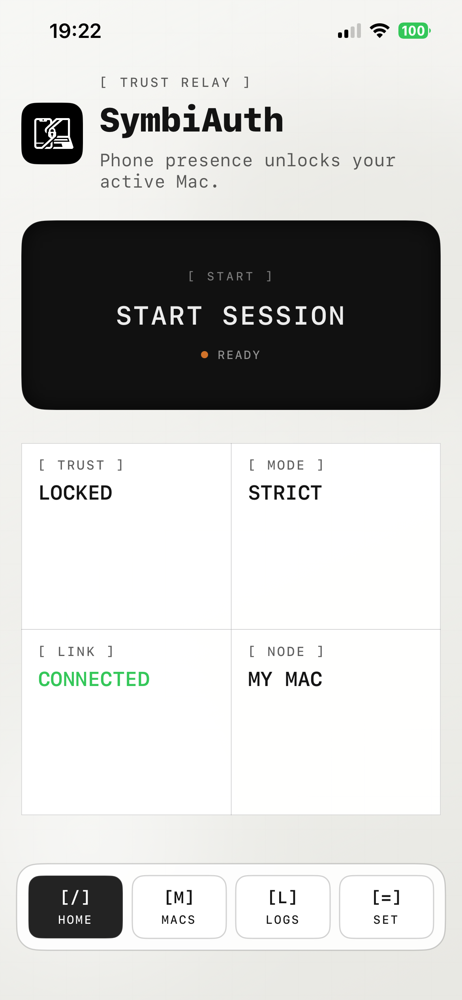
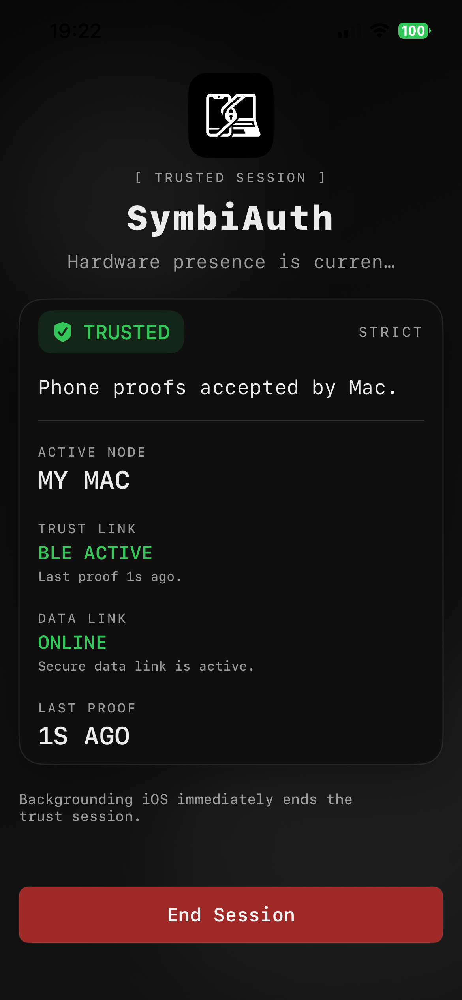
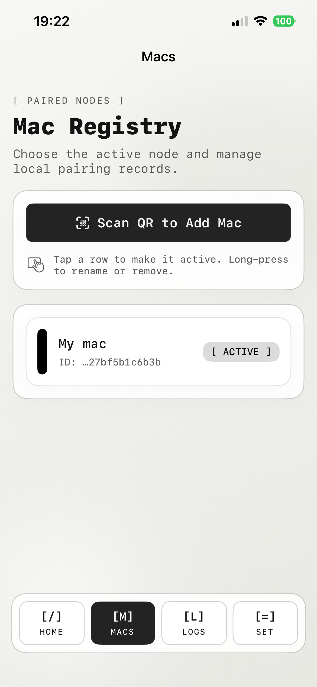
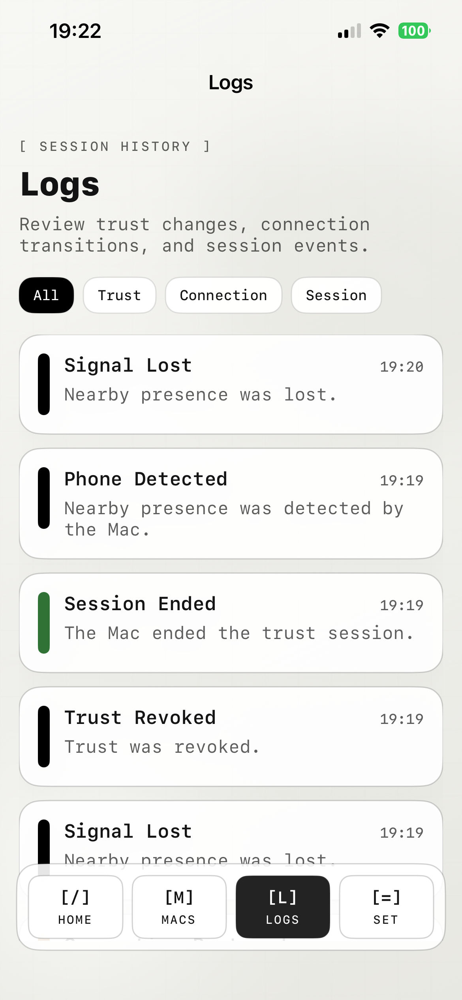
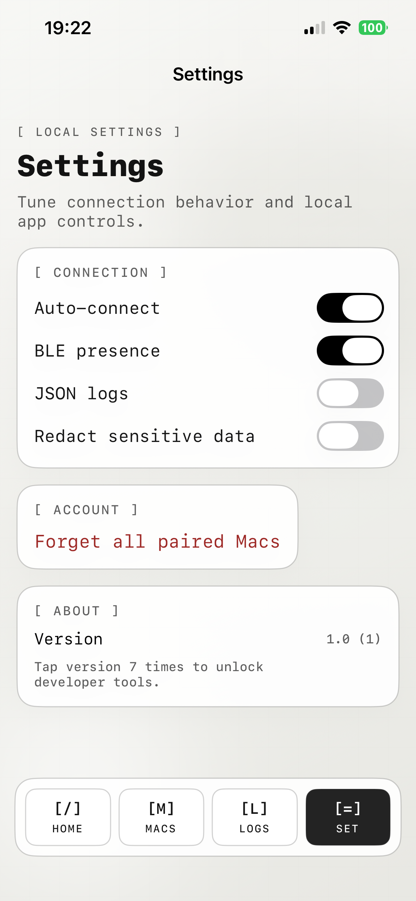
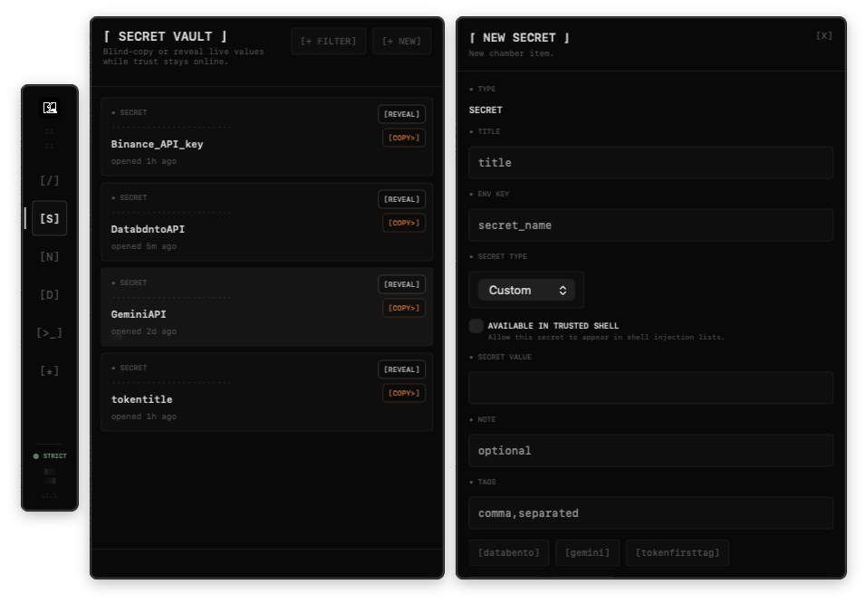
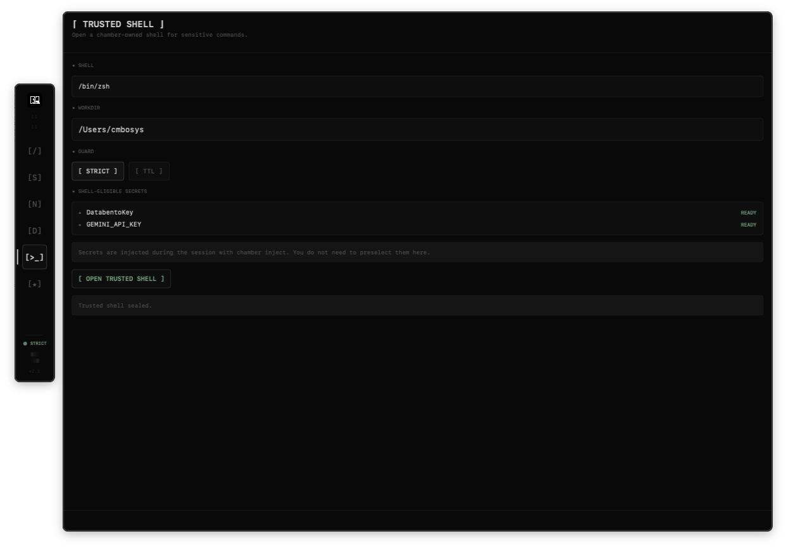

# SymbiAuth

SymbiAuth is an iPhone-authorized trust system for macOS.

It has three working surfaces:
- `Secret Chamber` on macOS for secrets, notes, and documents
- `Trusted Shell` for trust-bound terminal work with on-demand secret injection
- `chamber` CLI commands for running one command with injected env vars

## What It Does

- starts a trust session from the iPhone
- exposes a chamber on the Mac only while trust is active
- lets you reveal, copy, filter, and organize secrets
- opens a trusted shell and injects selected secrets into that shell session
- wraps one-off terminal commands through the CLI without leaving secrets in your parent shell

## What It Is Not

- not a password-manager replacement
- not a full terminal emulator
- not a claim that a compromised Mac cannot reach local state

Read [Security.md](Security.md) before treating it like a hardened security product.

## Videos

- [Watch macOS chamber and trusted shell demo](https://youtu.be/dDWaRmrt7Yo)
- [Watch iPhone and macOS onboarding demo](https://youtu.be/IoyZIVMLqVo)

## Screens

### iPhone

<p align="center">
  
  
  
</p>

<p align="center">
  
  
</p>

### macOS

<p align="center">
  
  
</p>

## First Run

You need:
- macOS
- Xcode
- Rust
- a physical iPhone

Start the local agent:

```bash
cargo run --manifest-path apps/agent-macos/Cargo.toml --bin agent-macos
```

Build and run the macOS app:

```bash
xcodebuild -project apps/tls-terminator-macos/ArmadilloTLS.xcodeproj \
  -scheme ArmadilloTLS \
  -configuration Debug \
  -derivedDataPath apps/tls-terminator-macos/build \
  build
open apps/tls-terminator-macos/build/Build/Products/Debug/ArmadilloTLS.app
```

Run the iPhone app from Xcode:

```text
apps/app-ios/ArmadilloMobile/ArmadilloMobile.xcodeproj
```

Then:
1. Pair the iPhone with the Mac from the QR flow.
2. Start a trust session on the iPhone.
3. Open the chamber from the macOS menu bar.
4. Use the chamber, trusted shell, or CLI while the trust session stays active.

## CLI

Check trust:

```bash
cargo run --manifest-path apps/agent-macos/Cargo.toml --bin agent-cli -- chamber status
```

List known secrets:

```bash
cargo run --manifest-path apps/agent-macos/Cargo.toml --bin agent-cli -- chamber list
```

Run one command with an injected env var:

```bash
cargo run --manifest-path apps/agent-macos/Cargo.toml --bin agent-cli -- \
  chamber run --env GEMINI_API_KEY -- \
  bash -lc 'echo ${#GEMINI_API_KEY}'
```

## Repo Layout

```text
apps/
  agent-macos/           Rust local agent and CLI
  app-ios/               iPhone app
  tls-terminator-macos/  macOS menu bar app and chamber UI
packages/
  protocol/              shared protocol definitions
  webext/                browser-extension work
docs/
  architecture.md
  threat_model.md
  tls_rotation.md
```

## Naming

Public name: `SymbiAuth`

You will still see old internal names in the codebase:
- `Armadilo`
- `Armadillo`
- `ArmadilloTLS`
- `ArmadilloMobile`
- `com.dreiglaser.*`

That cleanup is still in progress.

## Contributing

Read [CONTRIBUTING.md](CONTRIBUTING.md).

## License

MIT. See [LICENSE](LICENSE).
