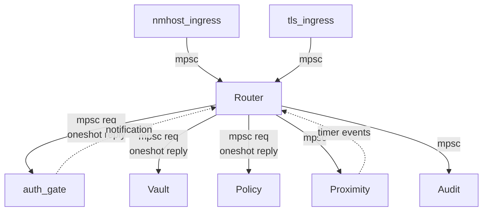

# Symbiauth Concurrency Model

## Overview

The Rust agent uses **Tokio** as its async runtime, implementing an actor-based concurrency model with message-passing channels for inter-component communication.

---

## Runtime

- **Async runtime**: Tokio (multi-threaded scheduler)
- **Core principle**: Shared-nothing actors communicating via bounded channels
- **No shared mutable state**: All state owned by individual actors

---

## Actor Architecture



### **Actors**

| Actor | Responsibility | Channel Pattern | Bounded Queue Size |
|-------|----------------|-----------------|-------------------|
| **tls_ingress** | Accept mTLS connections, parse frames, route to agent | mpsc → router | 100 messages |
| **nmhost_ingress** | Accept NM connections, validate frames, route to agent | mpsc → router | 50 messages |
| **router** | Bind `corr_id` to routes, dispatch requests, multiplex responses | mpsc from ingress; mpsc to actors (with oneshot reply_tx) | 200 messages |
| **auth_gate** | Queue auth.request, enforce rate limits, wait for iOS proof | **mpsc from router** (request carries oneshot reply_tx) | 10 outstanding auths |
| **vault** | Serialize vault access, encrypt/decrypt records, manage master key | **mpsc from router** (request carries oneshot reply_tx) | Unbounded (serialized via actor) |
| **policy** | Evaluate YAML rules, canonicalize origins, return Decision | **mpsc from router** (request carries oneshot reply_tx) | Unbounded (stateless, fast) |
| **proximity** | Track BLE/TLS heartbeats, emit lock/unlock events, manage timers | mpsc from TLS, timers | 5 events |
| **audit** | Append hash-chained log entries, fsync on commit | mpsc from all actors | 50 log entries |

---

## Channel Patterns

### **Request with Embedded Reply (mpsc + oneshot)**

**Recommended pattern** for router → actors:

```rust
// Actor's request type
struct VaultRequest {
    corr_id: String,
    key: String,
    reply_tx: oneshot::Sender<Result<Value, Error>>,
}

// Router sends request with embedded oneshot
let (reply_tx, reply_rx) = oneshot::channel();
vault_tx.send(VaultRequest { corr_id, key, reply_tx }).await?;
let value = reply_rx.await?;
```

**Properties**:
- Actor receives mpsc stream of requests (long-lived, serializable)
- Each request carries its own oneshot reply channel
- Single response per request
- Timeout enforced by caller (tokio::time::timeout)

### **Event Streams (mpsc)**

Used for continuous events (proximity changes, audit logs):

```rust
let (tx, mut rx) = mpsc::channel(10);
while let Some(event) = rx.recv().await {
    handle_event(event).await;
}
```

**Properties**:
- Many-to-one communication
- Bounded capacity (back-pressure)
- Receiver pulls at own pace

### **Notification (broadcast)**

Used for global state changes (proximity locked/unlocked):

```rust
let (tx, _rx) = broadcast::channel(16);
// Subscribers clone rx and listen
proximity_tx.send(ProximityEvent::Locked).ok();
```

---

## Invariants

### **1. One Response Per `corr_id`**

- Router binds `corr_id` → `response_tx` mapping
- After sending response, route is unbound
- Duplicate `corr_id` → error

### **2. No Blocking in Router**

- All router operations are `async` and non-blocking
- CPU-heavy work (crypto) offloaded to `tokio::task::spawn_blocking`
- Never hold locks across `.await` points

### **3. Vault Access Serialized**

- Single `Vault` actor owns SQLite connection
- All vault operations go through this actor (no direct DB access)
- Ensures ACID properties via WAL mode

### **4. Timers Live in `proximity`**

- Proximity actor owns all timers (heartbeat checks, auto-lock)
- Uses `tokio::time::interval` for periodic tasks
- Cancellation safe (timers dropped on actor shutdown)

---

## Cancellation Strategy

### **On Connection Close**

```rust
// TLS/NM ingress detects disconnect
ingress.on_disconnect(conn_id).await;

// Router unbinds all routes for this conn_id
router.unbind_all(conn_id).await;

// Pending auth.request cancelled
auth_gate.cancel_for_connection(conn_id).await;
```

**Properties**:
- Pending requests cleaned up immediately
- iOS receives no response (connection already closed)
- Prevents resource leaks

### **On Timeout**

```rust
tokio::time::timeout(Duration::from_secs(30), rx.await)
    .await
    .unwrap_or_else(|_| Err(Error::Timeout));
```

**Timeouts**:
- Auth: 30s
- Vault: 2s
- NM request: 1s
- Proximity heartbeat: 5s

---

## Back-Pressure Handling

### **Bounded Queues**

All `mpsc` channels have bounded capacity:

```rust
let (tx, rx) = mpsc::channel(100); // Max 100 pending messages
```

**On Full Queue**:
1. Sender calls `tx.try_send()` or `tx.send().await`
2. If full:
   - `try_send` → Returns `Err(TrySendError::Full)`
   - `send().await` → Returns error (with `trySend` configured)
3. Caller responds with `429 Too Many Requests` or  drops request

**Benefits**:
- Prevents memory exhaustion
- Provides back-pressure signal to clients
- Forces prioritization (newer requests may be dropped)

### **Rate Limiting**

**Token Bucket** per origin at TLS layer:

```rust
struct TokenBucket {
    tokens: f64,
    capacity: f64,
    refill_rate: f64, // tokens per second
    last_refill: Instant,
}

impl TokenBucket {
    fn take(&mut self) -> Option<()> {
        self.refill();
        if self.tokens >= 1.0 {
            self.tokens -= 1.0;
            Some(())
        } else {
            None // rate limit exceeded
        }
    }
}
```

**Limits**:
- Per-origin: 5 requests/min
- Global auth: 3 outstanding, 1 per origin
- Vault: No explicit limit (serialized access is natural limit)

---

## Error Propagation

Errors bubble up via `Result<T, Error>`:

```rust
async fn handle_request(req: Request) -> Result<Response, Error> {
    let decision = policy.evaluate(&req.scope).await?;
    if decision == Decision::Deny {
        return Err(Error::Denied);
    }
    vault.read(&req.key).await
}
```

**Error Handling**:
- Errors logged with `tracing::error!`
- Mapped to HTTP-style codes (400, 401, 403, 429, 500, 503)
- Response sent to caller with error code
- Connection remains open (errors don't kill connection)

---

## Testing Concurrency

### **Unit Tests**

- Use `#[tokio::test]` for async tests
- Mock channels with `mpsc::unbounded_channel()` for simplicity
- Test cancellation with `tokio::time::pause()`

### **Property Tests**

- `proptest` for fuzzing message sequences
- Invariant: no deadlocks, no panics, bounded memory

### **Load Tests**

- Spawn 1000 concurrent requests
- Verify back-pressure triggers before OOM
- Check queue sizes remain bounded

---

## Summary

- **Actors**: Shared-nothing, communicate via channels
- **Channels**: Bounded mpsc (many-to-one), oneshot (request/response), broadcast (notifications)
- **Invariants**: One response per `corr_id`, no blocking in router, serialized vault, timers in proximity
- **Cancellation**: On disconnect or timeout, clean up routes and pending auths
- **Back-pressure**: Bounded queues, token buckets, 429 responses

### **Router Implementation Pattern**

```rust
// Router actor loop
async fn run_router(
    mut ingress_rx: mpsc::Receiver<IngressMessage>,
    vault_tx: mpsc::Sender<VaultRequest>,
    auth_tx: mpsc::Sender<AuthRequest>,
) {
    let mut routes: HashMap<String, ConnId> = HashMap::new();
    
    while let Some(msg) = ingress_rx.recv().await {
        // 1. Bind corr_id → conn_id
        routes.insert(msg.corr_id.clone(), msg.conn_id);
        
        // 2. Forward to appropriate actor
        let (reply_tx, reply_rx) = oneshot::channel();
        let req = VaultRequest {
            corr_id: msg.corr_id.clone(),
            key: msg.key,
            reply_tx,
        };
        
        // 3. Check back-pressure
        if vault_tx.try_send(req).is_err() {
            // Queue full → return 429 immediately
            send_error(msg.conn_id, 429, "too_many_requests").await;
            routes.remove(&msg.corr_id);
            continue;
        }
        
        // 4. Await reply with timeout
        match tokio::time::timeout(Duration::from_secs(2), reply_rx).await {
            Ok(Ok(value)) => {
                send_response(msg.conn_id, value).await;
                routes.remove(&msg.corr_id); // Unbind on success
            }
            Ok(Err(_)) => {
                send_error(msg.conn_id, 500, "internal").await;
                routes.remove(&msg.corr_id);
            }
            Err(_) => {
                send_error(msg.conn_id, 408, "timeout").await;
                routes.remove(&msg.corr_id); // Unbind on timeout
            }
        }
    }
}
```

**Key points**:
- Bind `corr_id → conn_id` at ingress; unbind on reply, error, timeout, or connection close
- **Never hold a lock across `.await`**
- On timeout: send error to caller **and** unbind route
- Use `try_send` to detect back-pressure immediately


---

## Optional Polish

### **UDS Framing**

Use `tokio_util::codec::LengthDelimitedCodec` or similar for Unix socket framing:

```rust
use tokio_util::codec::{Framed, LengthDelimitedCodec};

let codec = LengthDelimitedCodec::builder()
    .max_frame_length(1024 * 1024) // 1 MB max
    .build();

let framed = Framed::new(socket, codec);
```

**Fuzz this codec** with `cargo-fuzz` to catch buffer overruns.

### **Zeroize Secrets**

Use `zeroize` crate to scrub secrets from RAM after use:

```rust
use zeroize::Zeroize;

let mut secret = vec![0u8; 32];
// ... use secret
secret.zeroize(); // Overwrites with zeros
```

**Minimize secret lifetime**: Decrypt → use → zeroize immediately.

### **CPU-Heavy Work Semaphore**

Introduce a `Semaphore` to bound concurrent CPU-heavy operations (crypto, hashing):

```rust
use tokio::sync::Semaphore;

static CRYPTO_SEMAPHORE: Semaphore = Semaphore::const_new(4); // Max 4 concurrent

async fn decrypt_vault_record(data: &[u8]) -> Result<Vec<u8>> {
    let _permit = CRYPTO_SEMAPHORE.acquire().await?;
    
    // CPU-heavy work
    tokio::task::spawn_blocking(move || {
        aes_decrypt(data)  
    }).await?
}
```

**Prevents starvation**: Ensures router can still process requests even during crypto storms.

