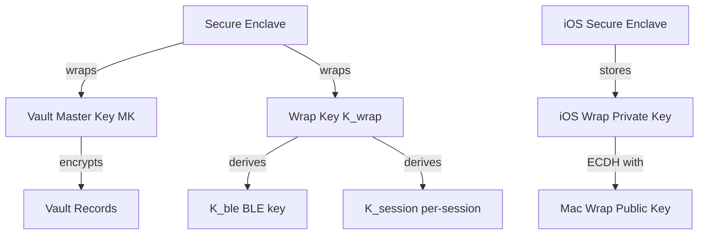

# Symbiauth Key Management

## Overview

Symbiauth uses a **layered key hierarchy** with the Secure Enclave at the root, ensuring all critical keys are hardware-protected.

---

## Key Hierarchy



---

## Vault Master Key (MK)

### **Generation**

```rust
fn generate_master_key() -> Result<[u8; 32]> {
    use rand::RngCore;
    let mut mk = [0u8; 32];
    rand::thread_rng().fill_bytes(&mut mk);
    Ok(mk)
}
```

### **Storage** (macOS Keychain + Secure Enclave)

```rust
fn store_master_key(mk: &[u8; 32]) -> Result<()> {
    // 1. Wrap with Secure Enclave
    let wrapped = SecureEnclave::wrap(mk)?;
    
    // 2. Store in Keychain
    let query = CFDictionary::from_CFType_pairs(&[
        (kSecClass, kSecClassGenericPassword),
        (kSecAttrService, CFString::new("armadillo")),
        (kSecAttrAccount, CFString::new("vault.mk")),
        (kSecValueData, CFData::from_buffer(&wrapped)),
        (kSecAttrAccessible, kSecAttrAccessibleWhenUnlocked),
    ]);
    
    SecItemAdd(&query, None)?;
    Ok(())
}
```

**Properties**:
- **256-bit AES key** (random)
- **Wrapped by Secure Enclave** (never stored in plaintext)
- **Keychain accessibility**: `kSecAttrAccessibleWhenUnlocked` (requires device unlock)
- **Survives agent crashes** (persisted in Keychain)

### **Retrieval**

```rust
fn load_master_key() -> Result<[u8; 32]> {
    // 1. Read wrapped key from Keychain
    let query = CFDictionary::from_CFType_pairs(&[
        (kSecClass, kSecClassGenericPassword),
        (kSecAttrService, CFString::new("armadillo")),
        (kSecAttrAccount, CFString::new("vault.mk")),
        (kSecReturnData, kCFBooleanTrue),
    ]);
    
    let wrapped: CFData = SecItemCopyMatching(&query)?;
    
    // 2. Unwrap with Secure Enclave
    let mk = SecureEnclave::unwrap(wrapped.bytes())?;
    
    Ok(mk.try_into().expect("MK must be 32 bytes"))
}
```

**On failure** (Keychain missing, SE unavailable):
- Agent logs error and exits
- User must re-initialize vault (data unrecoverable)

---

## Wrap Keys (K_wrap)

### **Purpose**

Long-term ECDH keypair for deriving session keys and BLE encryption keys.

### **Generation** (iOS + macOS)

**iOS**:
```swift
// Generate P-256 keypair in Secure Enclave
let privateKey = SecureEnclave.generateP256Key(
    label: "armadillo.wrap",
    accessibility: .whenUnlocked
)

let publicKey = SecureEnclave.getPublicKey(privateKey)
let pubSec1 = publicKey.sec1Representation() // 65 bytes uncompressed
```

**macOS**:
```rust
// Generate P-256 keypair
let (priv_key, pub_key) = generate_p256_keypair();

// Wrap private key with SE
let wrapped_priv = SecureEnclave::wrap(&priv_key)?;
keychain.set("armadillo.wrap.priv", wrapped_priv)?;

// Store public key (plaintext OK)
fs::write("~/.armadillo/wrap_pub.der", &pub_key.to_sec1())?;
```

###  **Exchange** (ECDH)

During pairing:
1. **iOS** → sends `wrap_pub_ios_b64` in `pairing.complete`
2. **macOS** → sends `wrap_pub_mac_b64` in `pairing.ack`
3. Both sides compute shared secret: `ECDH(own_priv, peer_pub)`

### **Derivation**

```rust
fn derive_session_key(mac_wrap_pub: &[u8], sid: &str) -> Result<[u8; 32]> {
    let ios_wrap_priv = keychain.get_p256_key("armadillo.wrap.priv")?;
    let shared = ecdh(ios_wrap_priv, mac_wrap_pub)?; // 32 bytes
    
    // HKDF with session ID as context
    let mut okm = [0u8; 32];
    Hkdf::<Sha256>::new(None, &shared)
        .expand(sid.as_bytes(), &mut okm)?;
    
    Ok(okm)
}
```

**Uses**:
- **K_session**: Per-session vault encryption key (derived from shared secret + `sid`)
- **K_ble**: BLE advertisement encryption (derived from shared secret + device fingerprint)

---

## Policy Signing Key (Optional)

> [!NOTE]
> Planned for Phase 4+; not implemented in MVP.

### **Purpose**

HMAC key to sign `policy.yaml` and detect tampering.

### **Generation**

```rust
fn generate_policy_hmac_key() -> Result<[u8; 32]> {
    let mut key = [0u8; 32];
    rand::thread_rng().fill_bytes(&mut key);
    
    // Store in Keychain
    keychain.set("armadillo.policy.hmac", &key)?;
    
    Ok(key)
}
```

### **Signing**

```rust
fn sign_policy(policy_yaml: &str) -> Result<[u8; 32]> {
    let key = keychain.get("armadillo.policy.hmac")?;
    let mac = Hmac::<Sha256>::new_from_slice(&key)?
        .chain_update(policy_yaml.as_bytes())
        .finalize();
    
    Ok(mac.into_bytes().into())
}
```

### **Verification**

```rust
fn verify_policy(policy_yaml: &str, expected_mac: &[u8; 32]) -> Result<()> {
    let computed_mac = sign_policy(policy_yaml)?;
   if computed_mac != *expected_mac {
        return Err(Error::PolicyTampered);
    }
    Ok(())
}
```

**Storage**:
- HMAC tag stored in `~/.armadillo/policy.yaml.sig`
- Agent verifies on startup; refuses to start if mismatched

---

## Cert Rotation

### **Current + Next Fingerprints**

QR code includes **two** fingerprints:

```yaml
{
  "fp_current": "abc123...",  # Currently active cert
  "fp_next": "def456...",     # Pre-pinned next cert (optional)
  "sid": "...",
  ...
}
```

**iOS pinning**:
```swift
func validateCert(_ cert: SecCertificate) -> Bool {
    let fp = computeSHA256(cert.derEncoded)
    return fp == fp_current || fp == fp_next
}
```

### **Rotation Process**

1. **Generate new cert**: `cert_new`, compute `fp_new`
2. **Update QR**: Set `fp_next = fp_new` in new QR codes
3. **Overlap window**: Keep old cert valid for 7 days
4. **Switch over**: After 7 days, delete old cert, `fp_current = fp_new`, `fp_next = None`

**Graceful degradation**:
- Old iOS devices with only `fp_current` pinned can still connect during overlap
- New iOS devices with both pins can connect before and after switch

---

## Backup & Restore (Post-MVP)

> [!NOTE]
> Designed, not implemented in Phase 1-3.

### **Export**

```rust
async fn export_backup(passphrase: &str) -> Result<EncryptedBackup> {
    // Master key NOT exported (stays in Keychain)
    let archive = BackupArchive {
        vault_data: vault.export_all().await?,
        policy: fs::read("~/.armadillo/policy.yaml").await?,
        pairings: pairing_db.export().await?,
        wrap_pub_mac: fs::read("~/.armadillo/wrap_pub. der").await?,
        version: 1,
    };
    
    // Encrypt with passphrase (Argon2id KDF)
    let salt = generate_random_16bytes();
    let key = argon2id_derive(passphrase, &salt, /* params */)?;
    let encrypted = aes_gcm_encrypt(&key, &archive.serialize()?)?;
    
    Ok(EncryptedBackup { salt, encrypted })
}
```

**Important**: Master key **not** exported; user must re-init vault or keep Keychain backup.

### **Restore**

```rust
async fn import_backup(encrypted: &EncryptedBackup, passphrase: &str) -> Result<()> {
    // Decrypt
    let key = argon2id_derive(passphrase, &encrypted.salt, /* params */)?;
    let decrypted = aes_gcm_decrypt(&key, &encrypted.encrypted)?;
    let archive: BackupArchive = deserialize(&decrypted)?;
    
    // Import
    vault.import_all(&archive.vault_data).await?;
    fs::write("~/.armadillo/policy.yaml", &archive.policy).await?;
    pairing_db.import(&archive.pairings).await?;
    
    Ok(())
}
```

**Limitation**: Requires master key still in Keychain; if wiped, can't decrypt vault.

---

## Summary

- **Vault Master Key (MK)**: 256-bit AES, wrapped by Secure Enclave, stored in Keychain with `kSecAttrAccessibleWhenUnlocked`
- **Wrap Keys (K_wrap)**: P-256 ECDH keypair (iOS in SE, macOS wrapped by SE); derives K_session and K_ble
- **Policy signing key (optional)**: HMAC-SHA256 key to detect policy.yaml tampering
- **Cert rotation**: Pin current+next fingerprints; 7-day overlap window; safe rollback
- **Backup (future)**: Export encrypted with Argon2id-derived key; MK not exported (stays in Keychain)
- **No plaintext keys**: All long-term keys either wrapped by SE or stored in SE directly
