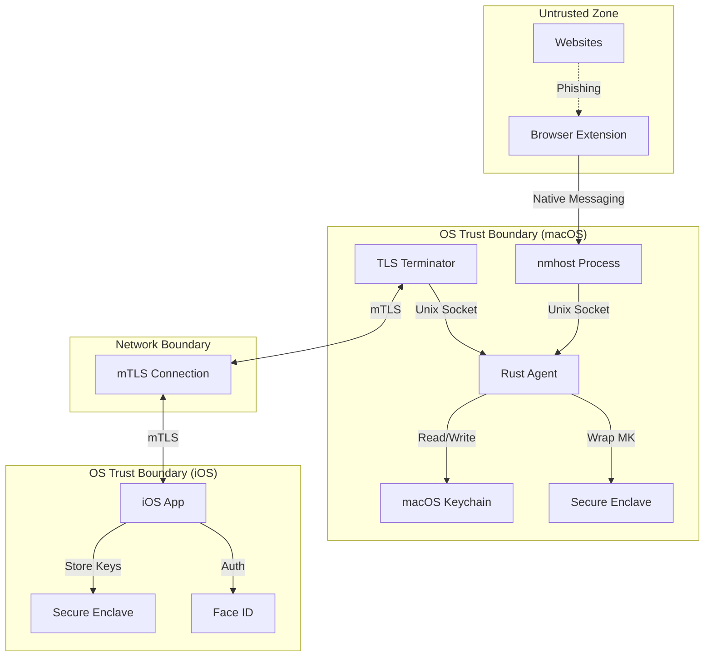

# Symbiauth Threat Model

## Executive Summary

Symbiauth is a local-only trust bridge between a macOS device and an iOS device. The iPhone acts as a "key" to control access to a local vault on the Mac, enabling trusted actions (autofill, commands) based on phone presence and Face ID approvals.

**Core Security Principle**: No cloud dependency; all operations are local-first with end-to-end encryption.

---

## Assets

### **Critical Assets**

| Asset | Description | Impact if Compromised |
|-------|-------------|----------------------|
| **Vault Master Key** | 256-bit encryption key for all vault data | Complete vault compromise |
| **Vault Credentials** | User passwords, secrets, tokens | Account takeover, data breach |
| **mTLS Certificates** | Client/server identities for iOS↔Mac | MitM attacks, impersonation |
| **Wrap Keys** | Long-term keys for vault key derivation | Offline brute-force attacks |
| **Device Fingerprints** | Cryptographic identities for pairing | Device spoofing |

### **Important Assets**

| Asset | Description | Impact if Compromised |
|-------|-------------|----------------------|
| **Session Tokens** | Time-limited auth tokens | Session hijacking (limited window) |
| **Scoped Capability Tokens** | Tokens with origin/action scope, stored per connection | Token theft enables scoped impersonation |
| **Audit Logs** | Hash-chained activity records, may contain origins/actions | Privacy leak if exfiltrated |
| **Policy File** | YAML (`~/.armadillo/policy.yaml`) defining step-up rules | Privilege escalation if tampered |
| **Pairing DB** | Device registry (fingerprints, session IDs) | Device spoofing, unauthorized pairing |
| **BLE Payload** | Encrypted proximity signal | Proximity spoofing (limited) |

---

## Trust Boundaries



### **Key Trust Boundaries**

1. **Process Boundary (Native Messaging)**: Browser Extension ↔ nmhost ↔ Agent (UDS, framing validation)
2. **Process Boundary (TLS)**: TLS Terminator ↔ Agent (UDS, strict `corr_id` binding) 
3. **Network Boundary**: TLS Terminator ↔ iOS App (mTLS + cert pinning)
4. **Privilege Boundary**: Agent ↔ macOS Keychain (Secure Enclave wrapped keys)
5. **Authentication Boundary**: Agent ↔ iOS Face ID (proof verification)

**UDS Security**:
- Agent socket directory: `~/.armadillo/` with `0700` permissions (user-only)
- Socket file: `a.sock` with `0600` permissions (user read/write only)
- Two ingress points (TLS terminator **and** Native Messaging Host) both speak UDS to agent - separate attack surfaces

---

## Threat Actors

### **Out of Scope**

> [!NOTE]
> The following threats are **explicitly out of scope** for Symbiauth:
> - **Nation-state attackers** with hardware implants or zero-days
> - **Physical coercion** (rubber-hose cryptanalysis)
> - **Supply chain attacks** on Apple hardware/OS
> - **Malicious family members** with physical access to unlocked devices

### **In Scope**

| Actor | Capability | Motivation | Examples |
|-------|-----------|------------|----------|
| **Web Attacker** | Control malicious website | Steal credentials | Phishing, XSS, credential theft |
| **Malware** | Code execution on Mac | Exfiltrate vault data | Keylogger, screen grabber |
| **Network Attacker** | Local network access | MitM, eavesdrop | Rogue WiFi, ARP spoofing |
| **Compromised Browser Extension** | Full browser access | Steal tokens, credentials | Malicious update, XSS |
| **Physical Attacker (opportunistic)** | Brief physical access | Steal device, clone data | Stolen Mac, evil maid |

---

## Threat Analysis

### **T1: Phishing Website Requests Credentials**

**Scenario**: User visits `evil-bank.com` which requests credentials for `bank.com`

**Attack Vector**:
```
1. User navigates to evil-bank.com
2. Site triggers autofill request via browser extension
3. Extension sends cred.get for evil-bank.com origin
4. User approves Face ID (doesn't notice wrong domain)
5. Attacker receives real bank.com credentials
```

**Mitigations**:
- ✅ **Origin canonicalization** in policy engine (normalize URLs)
- ✅ **Policy rules** require exact origin match for high-value domains
- ✅ **iOS UI** displays origin prominently in Face ID prompt
- ⚠️ **User education** (can't prevent social engineering entirely)

**Residual Risk**: **MEDIUM** - Relies on user noticing wrong domain in Face ID prompt

---

### **T2: Malware on Mac Reads Vault**

**Scenario**: Malware gains code execution on Mac and attempts to read vault

**Attack Vectors**:
1. **Direct vault file read** → `~/.armadillo/vault.bin`
2. **Agent process memory dump** → Extract master key from RAM
3. **UDS socket interception** → Replay requests to open vault
4. **Keychain extraction** → Steal wrapped master key

**Mitigations**:
- ✅ **Vault encryption** (AES-256-GCM with SE-wrapped master key)
- ✅ **Keychain protection** (`kSecAttrAccessibleWhenUnlocked`)
- ✅ **Secure Enclave wrapping** (MK never leaves SE in plaintext)
- ✅ **Face ID requirement** (malware can't approve auth.request)
- ✅ **Session token expiry** (limited time window)
- ⚠️ **Memory scrubbing** (zeroize secrets after use; minimize time secrets live in RAM; separate vault process optional)

**Residual Risk**: **MEDIUM-HIGH** - Malware with root can dump RAM, but SE wrapping limits offline attacks

---

### **T3: Network MitM Attack**

**Scenario**: Attacker controls local network (rogue WiFi) and attempts MitM

**Attack Vectors**:
1. **TLS downgrade** → Force plaintext or weak cipher
2. **Certificate substitution** → Replace server cert
3. **Session hijacking** → Steal session tokens
4. **Replay attacks** → Reuse intercepted messages

**Mitigations**:
- ✅ **Mutual TLS** (both client and server authenticated)
- ✅ **Certificate pinning** (agent fingerprint in QR code, iOS pre-pins)
- ✅ **No fallback** (reject connection if cert doesn't match)
- ✅ **Nonce-based Challenge** (SAS code prevents replay during pairing)
- ✅ **Local network only** (no internet routing)

**Residual Risk**: **LOW** - mTLS + pinning eliminates MitM without device compromise

---

### **T4: Compromised TLS Terminator**

**Scenario**: Bug in Swift TLS terminator allows attacker to control it

**Attack Vectors**:
1. **Frame injection** → Send forged messages to agent
2. **`corr_id` manipulation** → Route responses to wrong client
3. **Decryption** → Access vault data in transit

**Mitigations**:
- ✅ **TLS decrypts to agent's UDS only** (can't decrypt vault layer)
- ✅ **Strict `corr_id` binding** (agent validates token scope)
- ✅ **Agent-side token verification** (doesn't trust TLS routing)
- ✅ **No vault key access** (TLS has zero vault access)
- ✅ **Audit logging** (agent logs all requests with `corr_id`)

**Residual Risk**: **LOW-MEDIUM** - TLS compromise enables DoS but not data access

---

### **T5: QR Code MitM**

**Scenario**: Attacker shows fake QR code to user during pairing

**Attack Vectors**:
1. **Fake agent fingerprint** → iOS connects to attacker's machine
2. **Session ID substitution** → Hijack pairing session

**Mitigations**:
- ✅ **Agent fingerprint in QR** (binds iOS to specific Mac)
- ✅ **Short-lived QR** (expires after 60 seconds)
- ✅ **SAS code** (displayed on both devices, user verifies)
- ✅ **iOS cert pinning** (pins `fp_current` and `fp_next` from QR)
- ✅ **Session ID uniqueness** (prevents replay)

**Residual Risk**: **LOW** - Multi-factor verification (QR + SAS + visual confirmation)

---

### **T6: Auth Request Flooding (Battery Drain)**

**Scenario**: Malicious website floods user with Face ID prompts

**Attack Vectors**:
1. **Repeated `cred.get` requests** → Drain battery with Face ID prompts
2. **DoS user** → Make app unusable

**Mitigations**:
- ✅ **Rate limiting** - Token bucket per origin at TLS layer
  - **Concrete limits**: 3 outstanding prompts globally, 1 per origin
  - Token bucket: 5 requests/min per origin
  - 429 "Too Many Requests" back-pressure to caller
- ✅ **Request coalescing** (duplicate scopes merged)
- ✅ **Hard cap** (max 3 outstanding auth.request globally, 1 per origin)
- ✅ **User can deny** (Face ID cancel stops requests)
- ⚠️ **iOS local notification** (might wake device in background)

**Residual Risk**: **MEDIUM** - Can annoy user but limited by rate limits

---

### **T7: Vault Corruption During Crash**

**Scenario**: Agent crashes mid-write, corrupting vault

**Attack Vectors**:
1. **Partial write** → Vault file left in inconsistent state
2. **Lost master key** → Cannot decrypt after restart

**Mitigations**:
- ✅ **SQLite WAL mode** (atomic writes)
- ✅ **Write-ahead logging** (old data preserved until commit)
- ✅ **Master key in Keychain** (survives agent crash)
- ⚠️ **Backup/restore** (TODO: explicit vault export)

**Residual Risk**: **LOW** - WAL ensures atomicity

---

### **T8: Key Rotation Failure**

**Scenario**: User rotates vault master key but old key still vulnerable

**Attack Vectors**:
1. **Old backups** → Attacker recovers old vault file
2. **Lazy re-encryption** → Some records still use old key

**Mitigations**:
- ✅ **"next MK" mechanism** (gradual migration)
- ✅ **Lazy re-encryption** (records migrated on access)
- ⚠️ **Forced re-encryption** (TODO: explicit "rotate now" command)
- ⚠️ **Backup invalidation** (TODO: mark old backups as stale)

**Residual Risk**: **MEDIUM** - Old backups remain vulnerable until full re-encryption

---

## Attack Surface Summary

| Component | Exposure | Attack Surface | Mitigations |
|-----------|----------|----------------|-------------|
| **Browser Extension** | High (untrusted websites) | XSS, malicious sites | Origin validation, policy rules |
| **Native Messaging Host** | Medium (OS boundary) | Frame parsing bugs, NM protocol violations | Strictly validated framing, size limits |
| **TLS Terminator** | Medium (network) | mTLS bugs, routing errors, `corr_id` injection | Cert pinning, strict `corr_id` binding |
| **Rust Agent** | Low (local only) | Logic bugs, UDS parsing, policy bypass | Fuzzing, strict validation, UDS perms |
| **iOS App** | Low (user device) | Face ID bypass, BLE spoofing, suspension | Secure Enclave, Face ID API, timeouts |
| **Vault File** | High (filesystem) | Offline brute-force, file tampering | SE-wrapped encryption, perms `0600` |

---

## Conclusion

Symbiauth's threat model prioritizes **defense in depth** with multiple layers:

1. **Cryptographic**: mTLS, SE-wrapped keys, AES-256-GCM
2. **Architectural**: Strict trust boundaries, minimal privilege
3. **Operational**: Rate limiting, audit logs, policy enforcement
4. **User-facing**: Clear iOS prompts, SAS verification

**Highest Risks**:
- Malware with code execution on Mac (**medium-high**)
- Auth request flooding (**medium**)
- User social engineering (**medium**)

**Next Steps** (Phase 1+):
- Implement formal fuzzing for UDS/frame parsers
- Add explicit vault backup/restore with passphrase
- Add forced key rotation UI
- Conduct external security review

### **T9: Lost or Stolen Phone**

**Scenario**: Attacker gains physical access to unlocked iPhone

**Attack Vector**:
```
1. Attacker steals unlocked iPhone
2. Attacker approves auth.request prompts
3. Mac grants access to vault credentials
```

**Mitigations**:
- ✅ **Device passcode/biometrics** required to open app
- ✅ **Face ID for every `auth.request`** (not just app unlock)
- ✅ **Remote revoke from Mac** (unpair device command)
- ✅ **"Panic lock" on Mac** (disable all auth until re-paired)
- ⚠️ **Optional "require passcode after N minutes locked"** app setting

**Residual Risk**: **MEDIUM** - Depends on device being locked; Face ID protects individual requests

---

### **T10: BLE Relay / Proximity Spoofing**

**Scenario**: Attacker relays phone's BLE advertisements from afar to fake proximity

**Attack Vectors**:
1. **BLE relay device** → Extends BLE range beyond room
2. **Recorded BLE payload** → Replay old advertisements

**Mitigations**:
- ✅ **Combine BLE with active network proof** (TLS heartbeat with short TTL)
- ✅ **Hysteresis & RSSI sanity checks** (sudden distance changes rejected)
- ✅ **Never unlock on BLE alone** (policy defines unlock conditions)
- ✅ **Time-bound encrypted payload** (includes timestamp, expires quickly)

**Residual Risk**: **LOW-MEDIUM** - Distance-bounding is hard; policy reduces blast radius

---

### **T11: Extension Supply-Chain Compromise**

**Scenario**: Malicious browser extension update requests credentials at scale

**Attack Vectors**:
1. **Compromised developer account** → Push malicious update
2. **XSS in extension** → Inject `cred.get` requests

**Mitigations**:
- ✅ **MV3 minimal permissions** (no broad host permissions)
- ✅ **Per-origin capability tokens** (can't request arbitrary origins)
- ✅ **Origin shown in iOS Face ID prompt** (user sees which site)
- ✅ **Rate limiting/token bucket per origin** (limits scale of attack)
- ✅ **Signed/native host allow-list** (only trusted extensions can connect)

**Residual Risk**: **MEDIUM** - User might approve malicious prompt if distracted

---

### **T12: Policy File Tampering**

**Scenario**: Local attacker edits `~/.armadillo/policy.yaml` to disable step-up requirements

**Attack Vectors**:
1. **Direct file edit** → Modify YAML to weaken rules
2. **Replace with malicious policy** → All sites get auto-unlock

**Mitigations**:
- ✅ **File perms `0600`** (user read/write only)
- ✅ **On startup, verify owner+mode** (reject if incorrect)
- ⚠️ **Optional signed policy** (HMAC with local key in Keychain)
- ✅ **Policy hash logged to audit trail** (detects tampering)

**Residual Risk**: **LOW** if perms enforced; **MEDIUM** without HMAC signing

---

### **T13: Time Skew & Token TTL**

**Scenario**: Attacker manipulates Mac clock to extend session token lifetime

**Attack Vectors**:
1. **Set clock backwards** → Tokens never expire
2. **Rapid clock changes** → Bypass TTL checks

**Mitigations**:
- ✅ **Use monotonic clock for TTL checks** (unaffected by system time changes)
- ✅ **Include phone-provided server time in handshake** (detect skew)
- ✅ **Enforce max skew** (±90s tolerance; refuse if drift too high)
- ✅ **Timestamp in auth tokens** (validated against monotonic time)

**Residual Risk**: **LOW** - Monotonic clock prevents time manipulation

---

### **T14: Local UDS Flooding / DoS**

**Scenario**: Malicious process spams agent's Unix socket with requests

**Attack Vectors**:
1. **Request flood** → Exhaust agent resources
2. **Large payloads** → Out-of-memory crash

**Mitigations**:
- ✅ **Unix socket perms** (`0600` - only user can connect)
- ✅ **Per-client rate limiting** (token bucket per connection)
- ✅ **Bounded queues & back-pressure** (reject with 503 when full)
- ✅ **Kill misbehaving client** (close connection after threshold)
- ✅ **Max message size enforcement** (reject oversized frames)

**Residual Risk**: **LOW** - Rate limits and back-pressure prevent resource exhaustion

---

### **T15: iOS Background Suspension Mid-Auth**

**Scenario**: App backgrounded while Face ID prompt pending, agent stuck waiting

**Attack Vectors**:
1. **User backgrounds app** → Prompt never shown
2. **iOS suspends app** → Request times out on agent

**Mitigations**:
- ✅ **Prompt only when foreground** (check app state before showing Face ID)
- ✅ **If backgrounded, send actionable notification** → Deep link into app
- ✅ **Queue request with short TTL** (30s timeout on agent side)
- ✅ **Always auto-fail & notify agent on timeout** (don't leave agent hanging)
- ✅ **iOS continuation hygiene** (always resolve promise on success/timeout/cancel)

**Residual Risk**: **LOW** - Timeouts enforced, user gets clear notification

---

### **T16: Cert Rotation Desync**

**Scenario**: Server rotates mTLS cert but iPhone still pins old fingerprint

**Attack Vectors**:
1. **Cert expired** → Connection fails
2. **Phone can't connect** → Denial of service

**Mitigations**:
- ✅ **Pin current+next fingerprints** (iOS validates against both)
- ✅ **QR includes both `fp_current` and `fp_next`** (pre-pins new cert)
- ✅ **Graceful overlap window** (old cert valid for N days after rotation)
- ✅ **Audit log on rotation** (track cert changes)
- ⚠️ **TLS terminator sends "rotate-in" banner** before switching (gives iOS time to update)

**Residual Risk**: **LOW** - Dual-pin mechanism prevents desync

---

### **T17: Audit Log Privacy**

**Scenario**: Audit logs leaked, revealing user's browsing habits

**Attack Vectors**:
1. **Log file read** → Attacker sees which sites user logged into
2. **Log exfiltration** → Malware steals logs

**Mitigations**:
- ✅ **Logs stored locally only** (`~/.armadillo/audit.log`)
- ✅ **File perms `0600`** (user read/write only)
- ✅ **Retention policy** (rotate/delete old logs after N days)
- ⚠️ **Optional redaction of usernames** (log origin but not usernames)
- ✅ **Export requires explicit user action** (no automatic sync/upload)

**Residual Risk**: **LOW** - Local-only storage limits exposure; optional redaction reduces PII


### **T18: DOM/Clipboard Exfiltration**

**Scenario**: Hostile page JavaScript steals credentials via clipboard or DOM manipulation

**Attack Vectors**:
1. **Clipboard monitoring** → Read credentials if autofill uses clipboard
2. **DOM injection listeners** → Keylogger scripts capture filled values
3. **XSS in content script** → Compromise extension's isolated world

**Mitigations**:
- ✅ **Never use clipboard** for autofill (direct DOM injection only)
- ✅ **Fill via isolated world/content script** (not page JS context)
- ✅ **Prefer Credential Management API** when available
- ✅ **Block autofill on pages with active keyloggers** (detect event listeners)
- ✅ **CSP for extension pages** (prevent XSS in extension UI)

**Residual Risk**: **LOW-MEDIUM** - Isolated world prevents most attacks; keylogger detection is heuristic

---

### **T19: Native Messaging Host Hijack**

**Scenario**: Malicious browser extension attempts to communicate with nmhost

**Attack Vectors**:
1. **Random extension connects** → Impersonates legitimate extension
2. **Stolen extension ID** → Clones extension manifest
3. **Man-in-the-middle** → Intercepts native messaging socket

**Mitigations**:
- ✅ **Strict allow-list by extension ID** (hardcoded in nmhost)
- ✅ **Signed handshake** (extension proves identity with challenge)
- ✅ **Refuse unknown origins** (log and reject)
- ✅ **Per-client rate limiting** (prevent abuse even if allowed)
- ✅ **Extension nonce verification** (each message includes signed nonce)

**Residual Risk**: **LOW** - Extension ID + signed handshake prevents impersonation

---

### **Multi-User macOS Considerations**

**UDS Path & Permissions**:
- Socket path: `~/.armadillo/a.sock` (per-user home directory)
- Directory perms: `0700` (owner read/write/execute only)
- Socket perms: `0600` (owner read/write only)
- **nmhost must run under same user as agent** (no cross-user access)
- Agent verifies connection UID matches agent UID (rejects cross-user)

**Policy File Integrity**:
- On startup, agent **must verify**:
  - `policy.yaml` owner == current user
  - `policy.yaml` mode == `0600`
- If wrong owner/perms → **hard fail** (refuse to start, log error)
- Optional: HMAC signature with local Keychain key (detects tampering)
- Policy hash logged to audit trail on every load

**Logging Privacy Rule**:
- **No secrets in logs, ever** (passwords, tokens, keys)
- Log origin + action only (e.g., "cred.get for example.com")
- Usernames **optional** and **redacted by default** (log as `<redacted>`)
- Audit logs contain: `ts`, `level`, `component`, `corr_id`, `origin`, `action`, `decision`, `latency_ms`, `err_code` (no PII)

